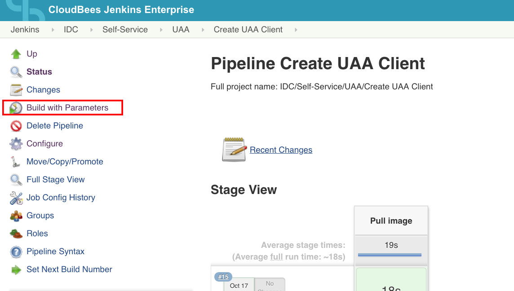
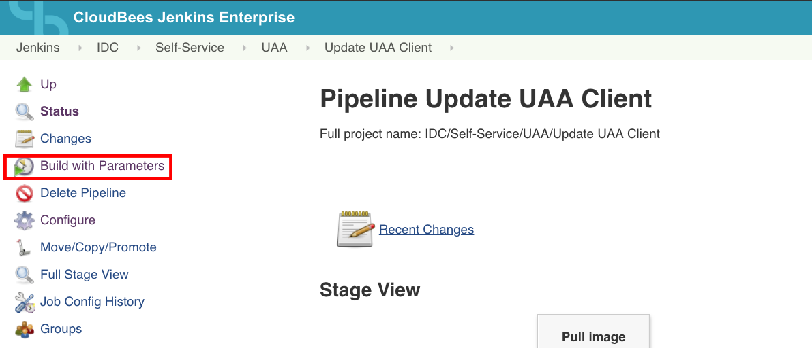
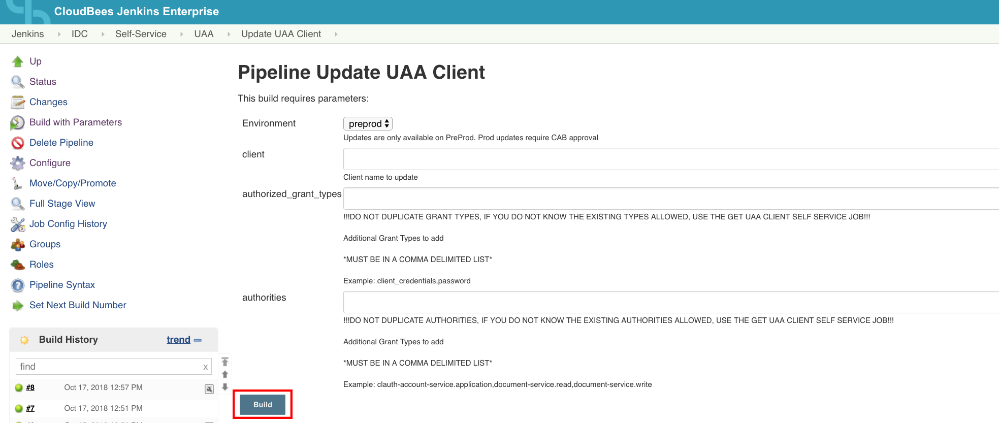
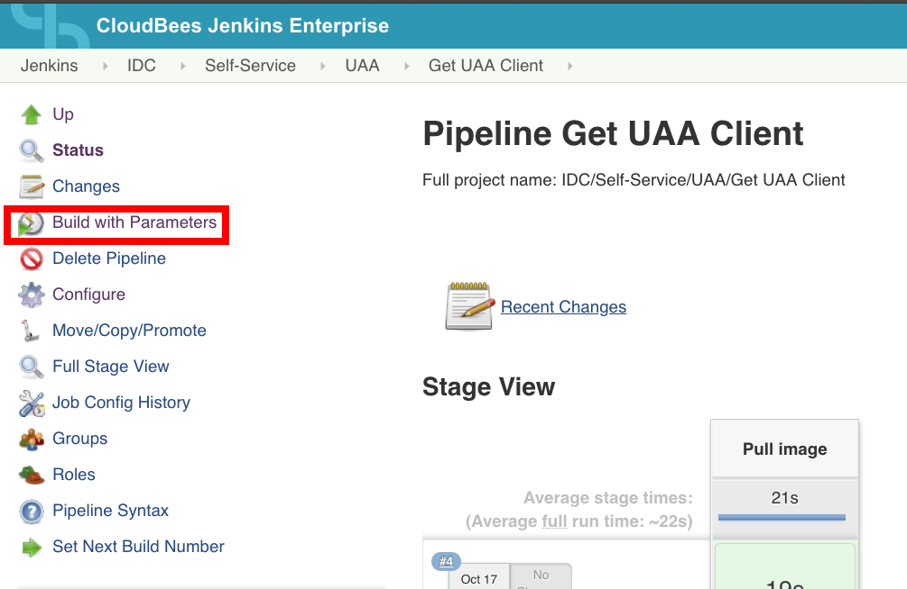
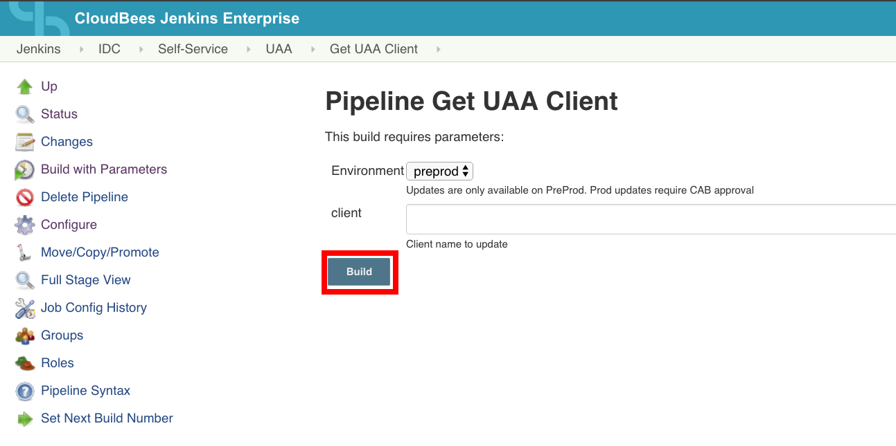
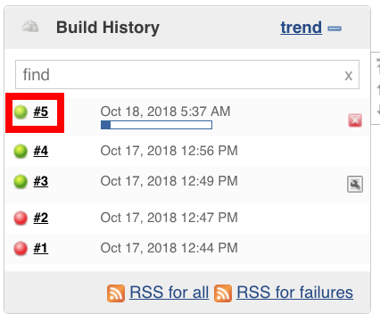
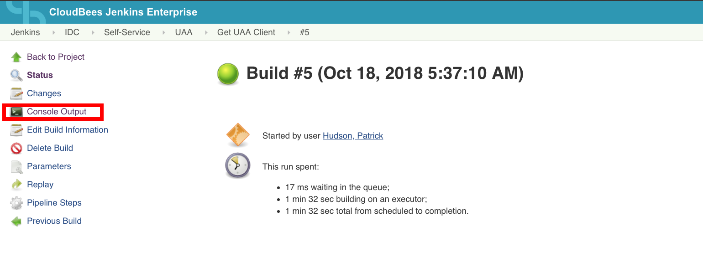

<!-- START doctoc generated TOC please keep comment here to allow auto update -->
<!-- DON'T EDIT THIS SECTION, INSTEAD RE-RUN doctoc TO UPDATE -->
# Contents

- [Setup](#setup)
- [Building Image for Hub2](#building-image-for-hub2)
- [Running Locally](#running-locally)
  - [Environment Variables](#environment-variables)
    - [Example Docker Run commands](#example-docker-run-commands)
- [Jenkins Job](#jenkins-job)
  - [Info](#info)
  - [How-To Create UAA Client](#how-to-create-uaa-client)
    - ["Building" Create Job](#building-create-job)
      - [Required information](#required-information)
      - [Steps](#steps)
    - [Retrieving Encrypted Client Secret](#retrieving-encrypted-client-secret)
  - [How-To Update UAA Client](#how-to-update-uaa-client)
    - ["Building" Update Job](#building-update-job)
      - [Required information](#required-information-1)
      - [Steps](#steps-1)
  - [How-To Get UAA Client](#how-to-get-uaa-client)
    - ["Building" Get Job](#building-get-job)
      - [Required information](#required-information-2)
      - [Steps](#steps-2)

<!-- END doctoc generated TOC please keep comment here to allow auto update -->

# Setup
---

1. Create UAA config file, and copy credentials from UAA config stored in credential storage system

  `touch uaa/uaa.config`

2. Create Config Server Cipher config with credentials stored in credential storage system

  `touch config-server/config-server-cipher.config`

3. Create SSH key by copying github SSH key from any of the Jenkins Agent

  `touch ./id_rsa`

# Building Image for Hub2
---

```
docker build -t docker-uaac . && docker tag docker-uaac hub2.corelogic.net/docker-uaac:latest &&  docker push hub2.corelogic.net/docker-uaac:latest
```

# Running Locally
---

## Environment Variables

**Variables are case sensitive**

| Variable      | Options | Description          
|-------------|-------------|----------
| `ACTION`*     | `add` `update`| `add` will create a new UAA client, `update` will update a UAA client with provided information
| `PCFENV`*      | `preprod` `prod`    | Use `preprod` to add or update a client in that env, `prod` can only be used to add.    
| `SCOPE` | `comma delimited string`   | Pass `string` in a comma delimited list
| `CLIENT`* | `string`   | Client username to add/update  
| `GRANTS` | `comma delimited string`   | Pass `string` in a comma delimited list for scope
| `AUTHORITIES` | `comma delimited string`   | Pass `string` in a comma delimited list for scope


** * is a required variable to pass**

### Example Docker Run commands

`docker run -it -e PCFENV="preprod" -e ACTION="add" -e SCOPE="myapp-account-service.application" -e CLIENT="myapp-test" -e GRANTS="password,refresh_token" -e AUTHORITIES="myapp-account-service.application" --rm docker-uaac-add`

`docker run -it -e PCFENV="preprod" -e ACTION="update" -e CLIENT="myapp-test" -e GRANTS="client_credentials" -e AUTHORITIES="document-service.read,document-service.write" --rm docker-uaac-add`

# Jenkins Job
---

[Create UAA Client](https://jkci.corelogic.net/job/IDC/job/Self-Service/job/UAA/job/Create%20UAA%20Client/)

[Update UAA Client](https://jkci.corelogic.net/job/IDC/job/Self-Service/job/UAA/job/Update%20UAA%20Client/)

[Get UAA Client](https://jkci.corelogic.net/job/IDC/job/Self-Service/job/UAA/job/Get%20UAA%20Client/)

## Info

1. All jobs are pipeline based. Each job has a slightly modified pipeline to account for add/get/update
```
node('dck01') {
    stage('Pull image') {
      sh docker pull hub2.corelogic.net/docker-uaac
      sh "docker run -e ACTION=\"add\" -e PCFENV=\"${params.Environment}\" -e SCOPE=\"${params.scope}\" -e CLIENT=\"${params.client}\" -e GRANTS=\"${params.authorized_grant_types}\" -e AUTHORITIES=\"${params.authorities}\" --rm  hub2.corelogic.net/docker-uaac"
    }
}
```
2. Jobs must be run on dck01 (this is already being enforced)

## How-To Create UAA Client
[Create UAA Client](https://jkci.corelogic.net/job/IDC/job/Self-Service/job/UAA/job/Create%20UAA%20Client/)

### "Building" Create Job

#### Required information

| Option | Description | Example
|---------|------------|---------
| `Environtment`*        | Options include preprod and prod                                                                   |`preprod`
|`client`                | Client name for UAA client.                                                                        | `myapp-client`
|`scope`                 | Comma Delimited list of scopes to add.                                                             | `uaa.resource,myapp-account-service.application`
|`authorized_grant_types`| Comma Delimited list of grant types to add. <br> Generally the default option is a good starting point. | `client_credentials,password,refresh_token`
|`authorities`           | Comma Delimited list of authorities to add.                                                        |`myapp-billing-service.application,myapp-email-service.application,myapp-scheduler-service.application`


#### Steps

1. Click Build with Parameters



2. Fill in required info using above table as reference


### Retrieving Encrypted Client Secret

1. After build has started, Click on the number for the build in the Build History box


2. Click on Console Output in the Build Details page


3. Console output should look like this

```
Started by user Hudson, Patrick
[Pipeline] node
Running on bnrqn1vplxdck01.infosolco.net in /apps/workspace/workspace/IDC/Self-Service/UAA/Create UAA Client
[Pipeline] {
[Pipeline] stage
[Pipeline] { (Pull image)
[Pipeline] sh
[Create UAA Client] Running shell script
+ docker pull hub2.corelogic.net/docker-uaac
Using default tag: latest
latest: Pulling from docker-uaac
Digest: sha256:51431ff2a49e370bba39af827a3e508972169a44e404a9a1e64e8e12ed41e795
Status: Image is up to date for hub2.corelogic.net/docker-uaac:latest
[Pipeline] sh
[Create UAA Client] Running shell script
+ docker run -e ACTION=add -e PCFENV=preprod -e SCOPE=uaa.resource -e CLIENT=patrick-test-1 -e GRANTS=client_credentials -e AUTHORITIES=uaa.resource --rm hub2.corelogic.net/docker-uaac

Target: https://opsmgr.preprodapp.cfadm.corelogic.net/uaa

Client ID:  Client secret:  
User name:  Password:  *********

Successfully fetched token via owner password grant.
Target: https://opsmgr.preprodapp.cfadm.corelogic.net/uaa
Context: admin, from client opsman


Target: https://uaa.preprodapp.cf.corelogic.net


Successfully fetched token via client credentials grant.
Target: https://uaa.preprodapp.cf.corelogic.net
Context: admin, from client admin

uaac client add patrick-test-1 --scope uaa.resource --authorized_grant_types client_credentials --authorities uaa.resource -s M2ZhZTM3Nzg4
  scope: uaa.resource
  client_id: patrick-test-1
  resource_ids: none
  authorized_grant_types: client_credentials
  autoapprove:
  authorities: uaa.resource
  name: patrick-test-1
  required_user_groups:
  lastmodified: 1539806085000
  id: patrick-test-1
*****************************!!!ENCRYPTED CLIENT SECRET!!!*****************************
AQAowbQbVy8362MssFs6GOLgNxC/Z7ed3ZT5HRRIDWtBwzr+vlIHyOo4+ivBW75b/pl7/N8Ut5k08AX016h7zvxnOc2atiQfkPV5ywQUBBW+PRbkc9F5fO458xGCfVGWNeZ2NfcphAh7KLGTu6jHd1dZHBU41ZSfXpoZRZMPOlVAhTD2OhwuQXDvMxVhjcDcmzivDN6Gcw5Ans9bNA+V6qHg1e8rn/e5+iRuHG+KO9u53Cfr0gzwpEcUdqhThpsSX5odcXhS+GyM4jMKqzKopIW291leUxSdAgYUqEJHk4U78hcvPbaufVQ2oQr9X6vhhWmtDJz0pC4HKG/XADenDUfBQ4vr/B9ADNju3RYB3bhU9yQnbs14VJTu5JWG6jFpzRk=
*****************************!!!ENCRYPTED CLIENT SECRET!!!*****************************
[Pipeline] }
[Pipeline] // stage
[Pipeline] }
[Pipeline] // node
[Pipeline] End of Pipeline
Finished: SUCCESS
```

4. The encrypted secret is indicated between

```
*****************************!!!ENCRYPTED CLIENT SECRET!!!*****************************

*****************************!!!ENCRYPTED CLIENT SECRET!!!*****************************
```

## How-To Update UAA Client

[Update UAA Client](https://jkci.corelogic.net/job/IDC/job/Self-Service/job/UAA/job/Update%20UAA%20Client/)

### "Building" Update Job

_INFO:  This job only UPDATES (in another words "appends") UAA grant types and authorities. It does not replace, remove, or revoke any existing grants/authorities on the UAA account. If you require revocation of a certain grant, authority, or scope please reach out to the `#devops-requests` channel in Slack for assistance_

#### Required information

> ** VERY IMPORTANT **
<br><br> ** !!!DO NOT DUPLICATE GRANT TYPES, IF YOU DO NOT KNOW THE EXISTING TYPES ALLOWED, USE THE GET UAA CLIENT SELF SERVICE JOB!!! **


| Option | Description | Example
|---------|------------|---------
| `Environtment`      | Preprod only, CAB required for PROD updates|`preprod`
|`client`                | Client name for UAA client to update.               | `myapp-client`
|`authorized_grant_types`| Comma Delimited list of grant types to add. <br> Generally the default option is a good starting point. | `client_credentials,password,refresh_token`
|`authorities`           | Comma Delimited list of authorities to add.                                                        |`myapp-billing-service.application,myapp-email-service.application,myapp-scheduler-service.application`

#### Steps

1. Click Build with Parameters



2. Fill in required info using above table as reference



3. Verify your additions were applied successfully either by checking the Console output for your last build, or use the [Get UAA Jenkins Job](https://jkci.corelogic.net/job/IDC/job/Self-Service/job/UAA/job/Get%20UAA%20Client/)

## How-To Get UAA Client

[Create UAA Client](# How-To Update UAA Client

[Get UAA Client](https://jkci.corelogic.net/job/IDC/job/Self-Service/job/UAA/job/Get%20UAA%20Client/)

### "Building" Get Job


#### Required information

| Option | Description | Example
|---------|------------|---------
| `Environtment`      | Preprod only, CAB required for PROD updates|`preprod`
|`client`                | Client name for UAA client to update.               | `myapp-client`

#### Steps

1. Click Build with Parameters



2. Fill in required info using above table as reference



3. After build has started, Click on the number for the build in the Build History box



4. Click on Console Output in the Build Details page



5. Console Output should look like this

```
Started by user Hudson, Patrick
[Pipeline] node
Running on bnrqn1vplxdck01.infosolco.net in /apps/workspace/workspace/IDC/Self-Service/UAA/Get UAA Client
[Pipeline] {
[Pipeline] stage
[Pipeline] { (Pull image)
[Pipeline] sh
[Get UAA Client] Running shell script
+ docker pull hub2.corelogic.net/docker-uaac
Using default tag: latest
latest: Pulling from docker-uaac
Digest: sha256:e12f8e8d8c0c14a031d8c37c1689252e74d69f2274e57f0d43ddd0d5e37a241b
Status: Image is up to date for hub2.corelogic.net/docker-uaac:latest
[Pipeline] sh
[Get UAA Client] Running shell script
+ docker run -e ACTION=get -e PCFENV=preprod -e CLIENT=patrick-test-1 --rm hub2.corelogic.net/docker-uaac
Target: https://opsmgr.preprodapp.cfadm.corelogic.net/uaa

Client ID:  Client secret:  
User name:  Password:  *********

Successfully fetched token via owner password grant.
Target: https://opsmgr.preprodapp.cfadm.corelogic.net/uaa
Context: admin, from client opsman

Target: https://uaa.preprodapp.cf.corelogic.net


Successfully fetched token via client credentials grant.
Target: https://uaa.preprodapp.cf.corelogic.net
Context: admin, from client admin

*****************************!!!CLIENT DETAILS!!!*****************************
scope: uaa.resource
client_id: patrick-test-1
resource_ids: none
authorized_grant_types: client_credentials
autoapprove:
authorities: uaa.resource clauth-user-service
name: patrick-test-1
lastmodified: 1539806278000
*****************************!!!CLIENT DETAILS!!!*****************************
[Pipeline] }
[Pipeline] // stage
[Pipeline] }
[Pipeline] // node
[Pipeline] End of Pipeline
```

6. The client details are indicated like below

```
*****************************!!!CLIENT DETAILS!!!*****************************

*****************************!!!CLIENT DETAILS!!!*****************************
```
