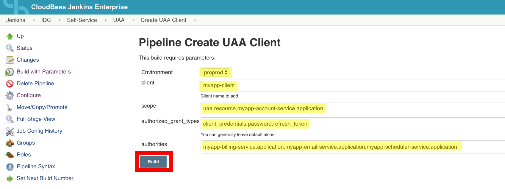

# Setup
---

1. Create UAA config file, and copy credentials from UAA config stored in credential storage system

  `touch uaa/uaa.config`

2. Create Config Server Cipher config with credentials stored in credential storage system

  `touch config-server/config-server-cipher.config`

3. Create SSH key by copying github SSH key from any of the Jenkins Agent

  `touch ./id_rsa`

# Building Image for Hub2
---

```
docker build -t docker-uaac . && docker tag docker-uaac hub2.corelogic.net/docker-uaac:latest &&  docker push hub2.corelogic.net/docker-uaac:latest
```

# Running Locally
---

## Environment Variables

**Variables are case sensitive**

| Variable      | Options | Description          
|-------------|-------------|----------
| `ACTION`*     | `add` `update`| `add` will create a new UAA client, `update` will update a UAA client with provided information
| `PCFENV`*      | `preprod` `prod`    | Use `preprod` to add or update a client in that env, `prod` can only be used to add.    
| `SCOPE` | `comma delimited string`   | Pass `string` in a comma delimited list
| `CLIENT`* | `string`   | Client username to add/update  
| `GRANTS` | `comma delimited string`   | Pass `string` in a comma delimited list for scope
| `AUTHORITIES` | `comma delimited string`   | Pass `string` in a comma delimited list for scope


** * is a required variable to pass**

### Example Docker Run commands

`docker run -it -e PCFENV="preprod" -e ACTION="add" -e SCOPE="myapp-account-service.application" -e CLIENT="myapp-test" -e GRANTS="password,refresh_token" -e AUTHORITIES="myapp-account-service.application" --rm docker-uaac-add`

`docker run -it -e PCFENV="preprod" -e ACTION="update" -e CLIENT="myapp-test" -e GRANTS="client_credentials" -e AUTHORITIES="document-service.read,document-service.write" --rm docker-uaac-add`

# Jenkins Job
---

[Create UAA Client](https://jkci.corelogic.net/job/IDC/job/Self-Service/job/UAA/job/Create%20UAA%20Client/)

[Get UAA Client]()

[Update UAA Client]()

## Info

1. All jobs are pipeline based. Each job has a slightly modified pipeline to account for add/get/update
```
node('dck01') {
    stage('Pull image') {
      sh docker pull hub2.corelogic.net/docker-uaac
      sh "docker run -e ACTION=\"add\" -e PCFENV=\"${params.Environment}\" -e SCOPE=\"${params.scope}\" -e CLIENT=\"${params.client}\" -e GRANTS=\"${params.authorized_grant_types}\" -e AUTHORITIES=\"${params.authorities}\" --rm  hub2.corelogic.net/docker-uaac"
    }
}
```
2. Jobs must be run on dck01 (this is already being enforced)

## How-To Create UAA Client
[Create UAA Client](https://jkci.corelogic.net/job/IDC/job/Self-Service/job/UAA/job/Create%20UAA%20Client/)

### "Building" Jenkins Job

#### Required information

| Option | Description | Example
|---------|------------|---------
| `Environtment`*        | Options include preprod and prod                                                                   |`preprod`
|`client`                | Client name for UAA client.                                                                        | `myapp-client`
|`scope`                 | Comma Delimited list of scopes to add.                                                             | `uaa.resource,myapp-account-service.application`
|`authorized_grant_types`| Comma Delimited list of grant types to add. <br> Generally the default option is a good starting point. | `client_credentials,password,refresh_token`
|`authorities`           | Comma Delimited list of authorities to add.                                                        |`myapp-billing-service.application,myapp-email-service.application,myapp-scheduler-service.application`



### Retrieving Encrypted Client Secret

1. After build has started, Click on the number for the build in the Build History box


2. Click on Console Output in the Build Details page


